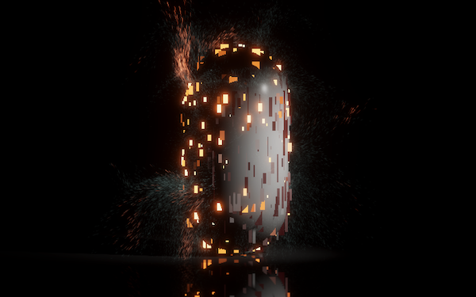

MFvfx
------

**MFvfx** is a Unity sample project that show how to bake normal mesh object to [visual effect graph]

it is based on [smrvfx] and fixed it to support meshfilter 

[smrvfx]: https://github.com/keijiro/smrvfx
[visual effect graph]: https://unity.com/visual-effect-graph

System Requirements
-------------------

- Unity 2020.1
